## 

::: {layout-ncol="4"}
{width="35%"}

{width="35%"}

{width="35%"}

{width="35%"}

{width="35%"}

{width="35%"}

{width="35%"}

{width="35%"}
:::

::: notes
i spend my 9-5 building and using tools for data science, like positron

i spend my 5-9 building and using tools for bookbinding. i love it becuase i get to combine so many different mediums: sewing, painting, paper crafting...it takes a lot of tools, but each story is a little different, so i want to make sure im using the right ones to get the right point across
:::

## 

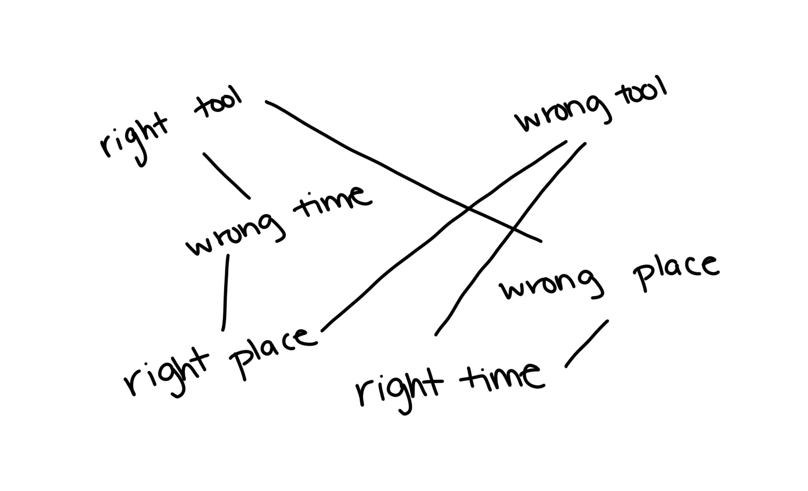{fig-align="center" width="85%"}

::: notes
thesis: a good product/tool must, first and foremost, work well for the task at hand. but using the right tool at in the right place at the right time is equally as important.

when i started rebinding books, i just used craft scissors for all mediums--whether i was cutting through fabric or cardboard, they worked! for a beginner, this was the right tool at the right time. nowadays, when I cut book cloth, I'll reach for fabric scissors instead, because those are the right tools for me now. but the mechanics of using the tool didn't really change, so switching from one type of scissors to another didn't feel like relearning
:::

## 

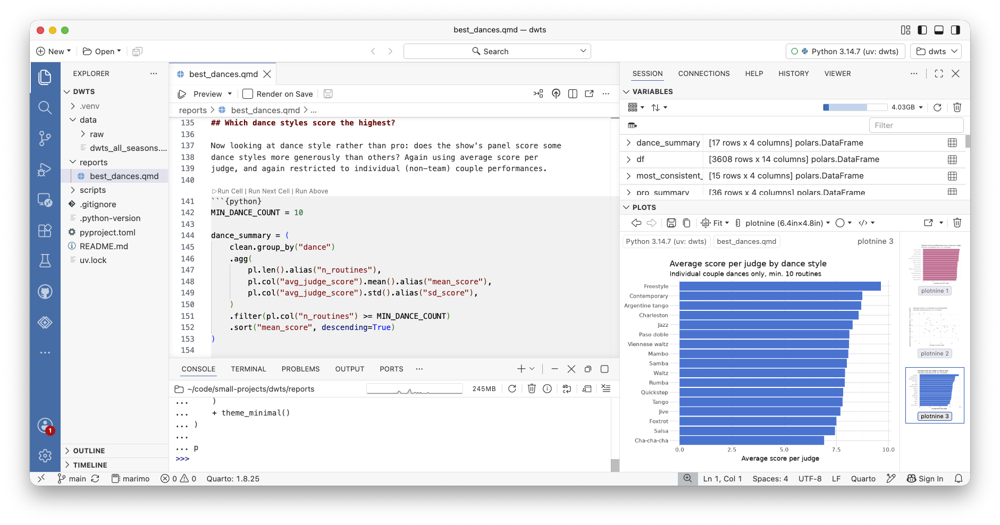{fig-align="center"}

::: notes
if i move this thesis to non-bookish products i work on...let's all think about Positron, an IDE for data science.

you've probably heard of positron itself, or posit cloud, or positron server, or positron on workbench! at their simplest core: these are all configurations of the front and back end configured in different locations.

Positron is a fork of Code-OSS
:::

## 

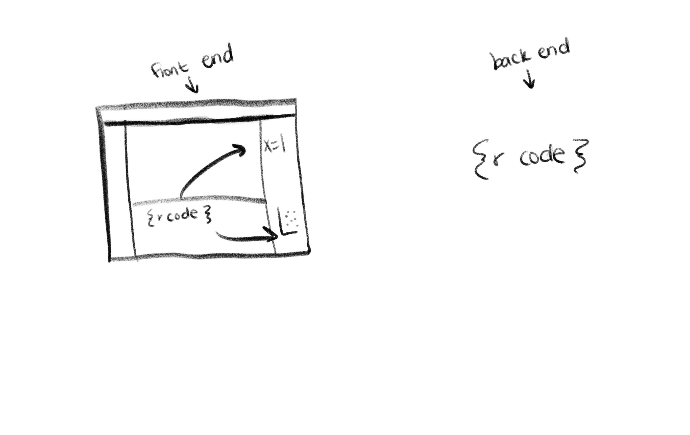{fig-align="center"}

::: notes
We can actually cut Positron in half and think of it as the front and back end

-   front end is what you see and touch
-   back end is what is executing code

That split is why all four deployment modes are even possible: the UI can run in one place while the actual R/Python sessions (via Ark, Positron's kernel) run somewhere else entirely.

"four separate products" to "one tool with four front doors"
:::

# Desktop Positron

{fig-align="center"}

::: notes
if we think of different ide formats like tools, i'd say desktop positron is like a set of crafting scissors

general purpose, the most used!
:::

## Desktop Positron

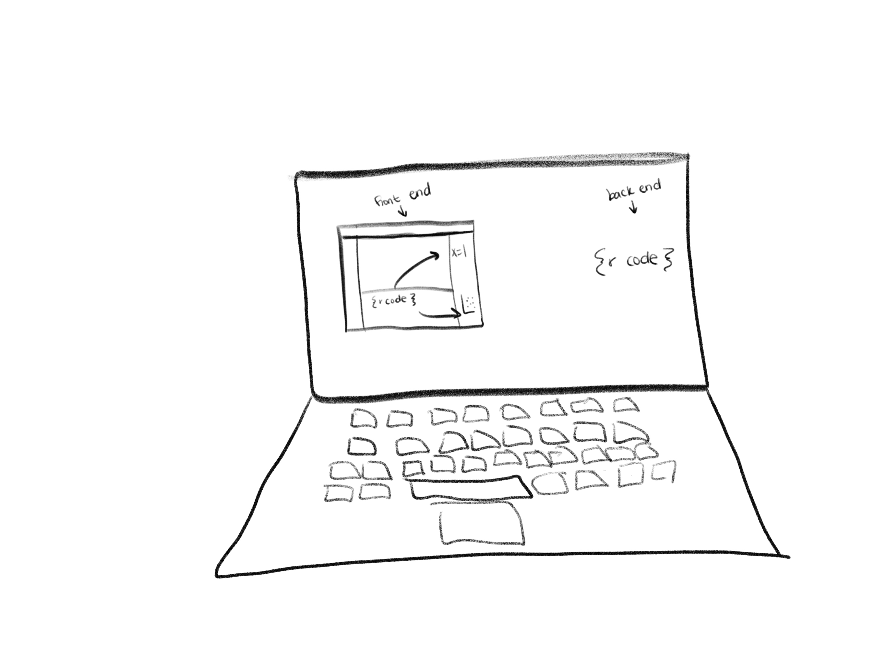{fig-align="center"}

::: notes
so, i've been on the positron team since it's firsrt launch! and this is the first, main way that positron was delivered

it is distributed in the easiest way, it's maybe not a surprise that this is the general purpose, most common way to use positron
:::

## Desktop Positron

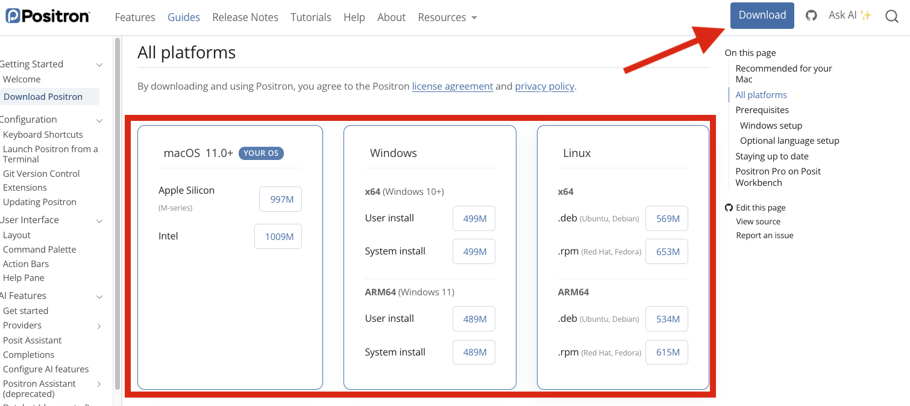{fig-align="center"}

::: notes
if you're a solo person, trying out an IDE, you're likely to encounter Positron in this way.

trying to figure out if this is what you're using or not, the easiest way to tell is, if you downloaded it from the Positron website! if so, yep, you have desktop positron
:::

## Desktop Positron

::: incremental
-   Pros: Full control of the IDE
    -   Maximum customization
    -   Manage your own installation and upgrades
-   Cons: Full control of the IDE
    -   Interpreter management
    -   Limited by machine performance
:::

::: notes
there are a lot of benefits of having positron on your own machine! ease of use and upgrading, special customizations, setup, managing Python and R installations, all of this is in your own control

-   Place: wherever, especially fit for folks who are doing everything on their laptop
-   Time: whenever, but involves the most setup for users, no "admin" in play

but it's possible that you still have some frustrations with the tools you use. maybe youre someone who is teaching a class or workshop and find yourself frustrated with spending an hour (or realisically a day) on setup. maybe youre someone who has access to cloud resources, but hate working in cloud-based ides. maybe your workloads are getting too large for your computer, and pressing run on your R script causes the fans in your laptop to turn on
:::

# Browser-based IDEs

::: notes
when you end up in one of these situations, you may feel like positron is not right, but its possible the flavor of problem means you need a different setup to better suit your needs

i'm calling browser the crazy scissors group, since these types of deployments have the capability of adding guardrails to dictate the way you work, similar to only being able to cut scallops
:::

## Browser-based IDEs

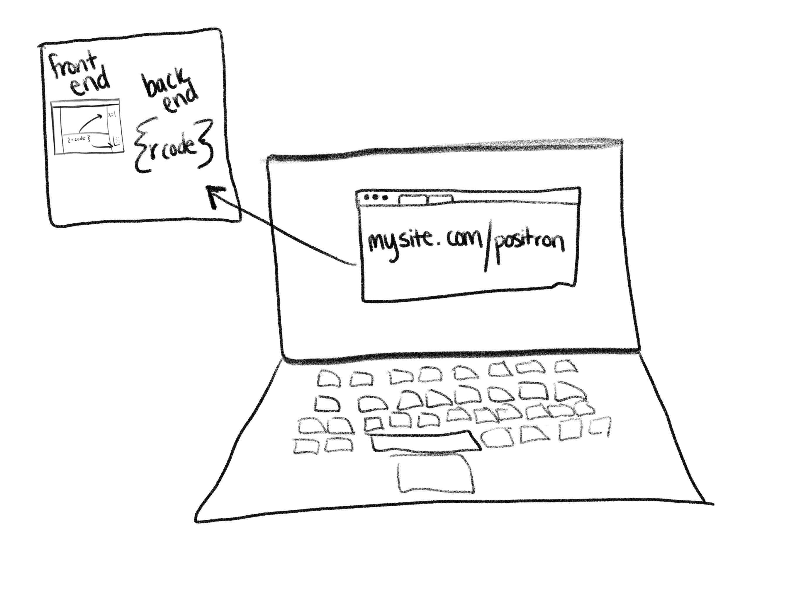{fig-align="center"}

::: notes
you can tell you're using a browser-based ide since you'll enter it via something like firefox or google chrome.

as a user, you will only have to interact with your web browser! the front end and back end live and run somewhere else (that somewhere else can be a lot of different places)
:::

## Browser-based IDEs

-   No setup for users
-   Admin-enforced guardrails
-   Compute not limited to your machine

::: notes
equitable environment, no "works on my machine," admin controls the lane

something to keep in mind, though, is that back end does have to run SOMEWHERE. so where does that need to live
:::

## Browser-based: Workbench

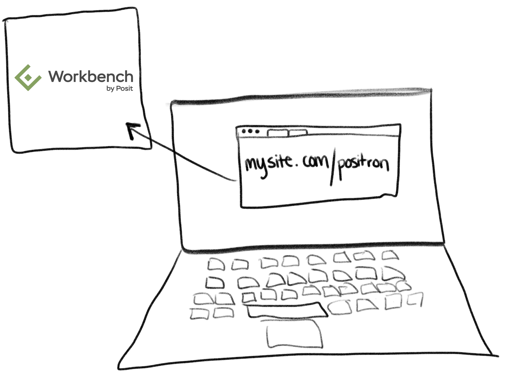{fig-align="center"}

::: notes
perhaps the most familiar way folks know of browser based Positron is via workbench, which is one of Posit's paid products for hosted IDEs

Positron has been available in general acailablity since TODO TIME XXXX

in use, admins set this up on usually your company's servers. and then users can log in from their company's portal!
:::

## Browser-based: Workbench

-   Especially fit for high compliance needs with features to help with auditing, etc
-   Requires admin to manage remote compute
-   Compute scales with the server, not your laptop

::: notes
the time we'll usually see this is when folks have high compliance needs

the place is your own arcitecture, installing this new application

auditiing
:::

## Browser-based: JupyterHub

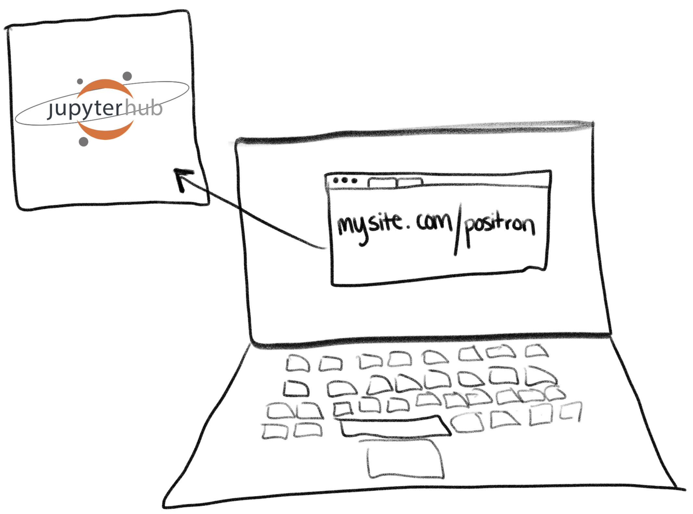{fig-align="center"}

::: notes

but, while Positron has been available on workbench, it turns out a lot of folks already have existing infratstructure they'd rather intrgrate with

i had the pleasure of chatting with dozens of educators alongside some of my colleagues earlier this year, and something we heard often was "well, i would use positron, but i dont have the time or ability to collaborate with IT to support workbench or carve out the compute space to run positron myself."

this really spoke to me, since i owe so much of what i know to the educators who helped me learn. this spring, i set off to work to integrate Positron into the places where it makes sense. We heard JupyterhHub over and over again, and so this is where I began
:::

## Browser-based: JupyterHub

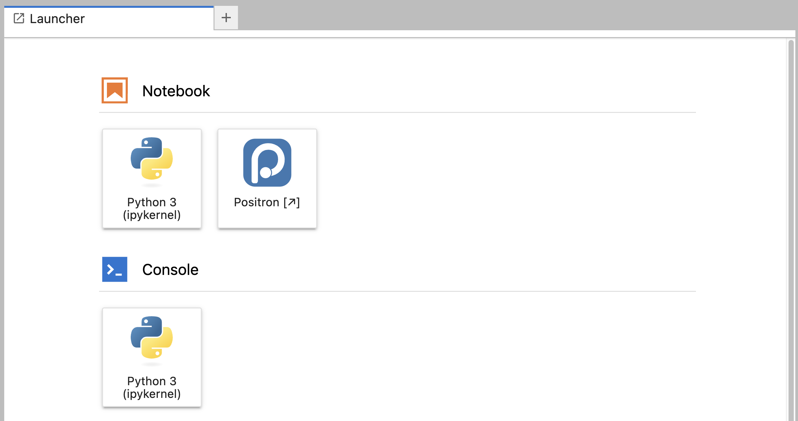{fig-align="center"}

::: notes
I'm now really excited to say that Positron is available for free for education use. You'll run Positron via a Python package called jupyter-server-proxy. 
:::

## Browser-based: JupyterHub

-   Free for educational use, requires a license
-   Great fit for classrooms and workshops where students shouldn't have to install anything
-   Lower admin setup burden than Workbench for orgs already invested in Jupyter infrastructure

::: notes
-   if youre running your own server with Positron on it, there will be higher setup costs for admins. users have the benefit of just clicking a button, but admins will configure the Jupyter Positron Server Python package, which is the glue between JupyterHub and Positron

-   Positron Server is available for educational use (like teaching and workshops) and is readily available for JupyterHub or OpenOnDemand

TIME: educational use
PLACE: jupyterhub
:::

## Browser-based: Posit Cloud

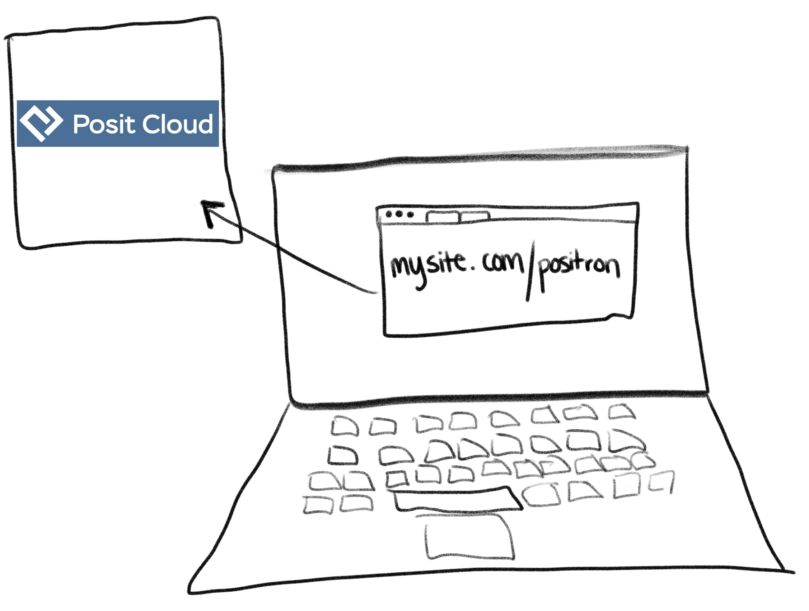{fig-align="center"}

::: notes
Back to those interviews earlier this year, we didn't JUST hear JupyterHub mentioned. So many folks were interested in using Positron on Posit Cloud.

:::

## Browser-based: Posit Cloud

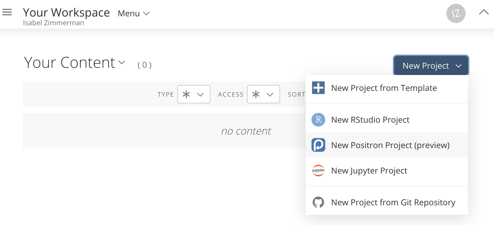{fig-align="center"}

::: notes
As of just a few weeks ago, Positron can also be used in Posit Cloud. This is as easy as clicking a link, requires no infrastructure or IT team, no trying to teach an entire classroom to install Positron
:::

## Browser-based: Posit Cloud

-   For users: click a link and you're in!
-   Zero infrastructure, ideal for trying Positron out
-   Good for onboarding a group (students, workshop attendees) without managing individual installs

::: notes
place is Posit Cloud, the TIME is 1) when you just want to try it out, or want something that wont melt your machine. 2) managing a group of, say, students, and dont want to manage installs for everyone

sharing with others via

-   Simplest for users and admins
-   Available as of September 2026
:::

## Browser-based: AWS SageMaker

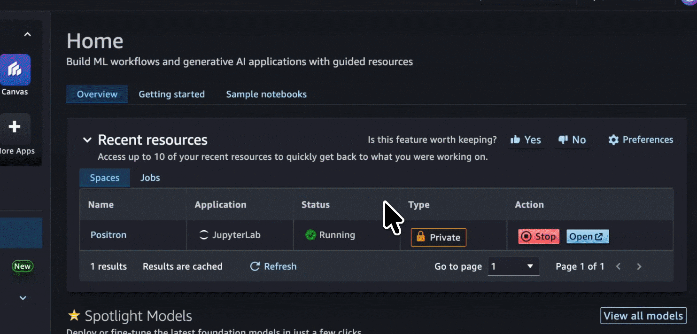{fig-align="center"}

::: notes
now, this has been talked about more extensively yesterday by james blair, but Positron on AWS another one of the newest front doors, positron running inside a SageMaker studio domain
:::

## Browser-based: AWS SageMaker

-   Fits teams already standardized on AWS/SageMaker for data and ML workflows
-   Data stays close to compute, no need to move it out of AWS

::: notes
place is wherever your AWS org already runs SageMaker
:::

# Remote SSH

{fig-align="center"}

::: notes
we've seen all on your computer and all off your computer, but what about A SECRET THIRD OPTION
:::

## Remote SSH

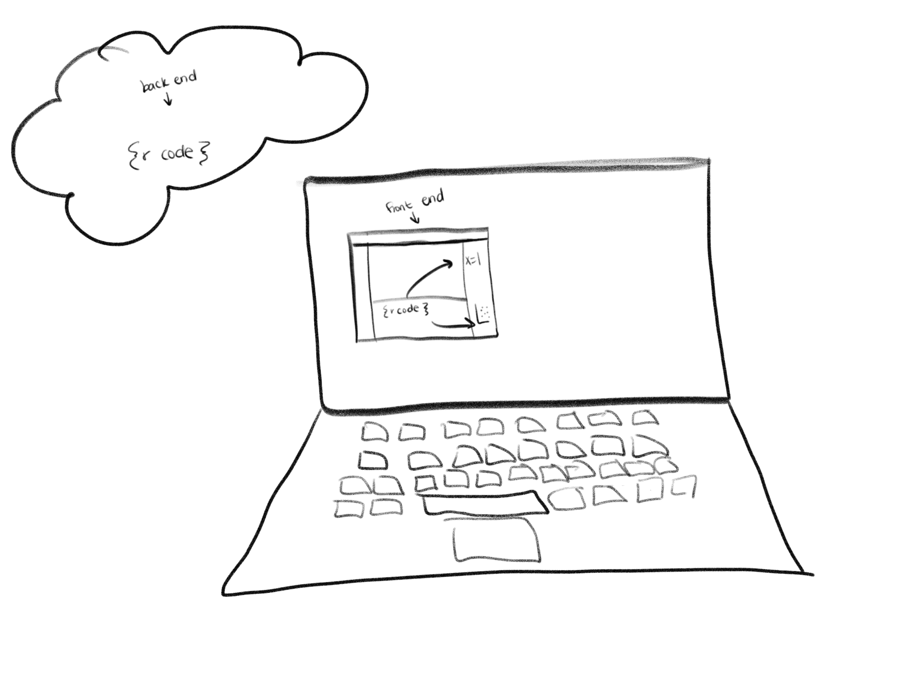{fig-align="center"}

::: notes
this is the one without a fancy product name attached to it: you already have a machine somewhere you can SSH into, and you point positron's desktop app at it

no browser, no admin-managed platform in between, just the same connection you'd already use to ssh in from a terminal
:::

## Remote SSH

-   For folks who already have a remote machine (lab server, cloud VM, HPC node) and just want to point an IDE at it
-   No browser layer or admin-managed product to install, just SSH access
-   More control than a managed browser deployment, without giving up your local desktop UI

::: notes
place is really anywhere you can ssh to, time is whenever you already have that access and don't want to wait on IT to stand up a whole new deployment

this is the one that feels the most like desktop positron day to day, the difference is just where the R/Python session actually lives
:::

##

{fig-align="center" width="85%"}

::: notes
back to the tool metaphor from the start: same idea, just scaled up from crafting scissors to an entire IDE

whether it's desktop, a browser, or ssh, it's still one tool, just met to fit the place and time it's being used in
:::

## IDE Roundup

::: {.ide-roundup}
::: {.ide-browser-group}
Browser-based

::: {.ide-box}
Posit Workbench
:::

::: {.ide-box}
JupyterHub / Open OnDemand
:::

::: {.ide-box}
Posit Cloud
:::

::: {.ide-box}
AWS SageMaker
:::
:::

::: {.ide-box .ide-standalone}
Desktop Positron everything local
:::

::: {.ide-box .ide-standalone}
Remote SSH front end local, back end remote
:::
:::

::: notes
one tool, four (plus) front doors -- same front end/back end split underlies every deployment mode
:::

## 

{fig-align="center" width="80%"}

::: notes
-   reframe: not a strict ladder people graduate from — people move back and forth (a Workbench user still opens Desktop at home)
-   each mode meets someone where they actually are *right now*
:::

## 

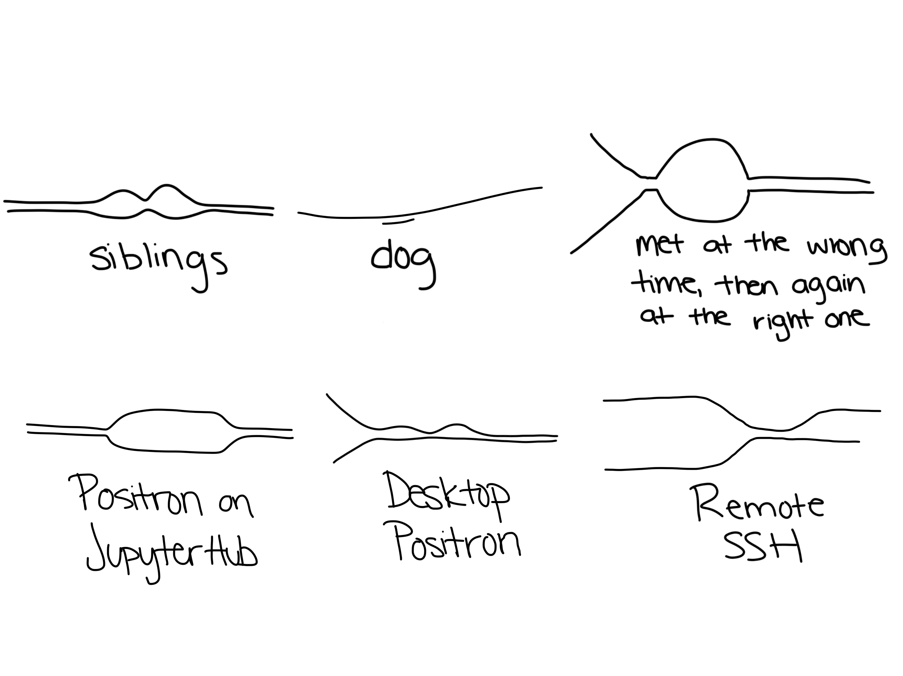{fig-align="center" width="40%"}

::: notes
-   return to the diagram: the three stages as one continuous line, changing shape, never ending

It's not just about getting people the right product. It's the right product, in the right place, at the right time.
:::

# thank you 👾

check out more positron @ positron.posit.co
